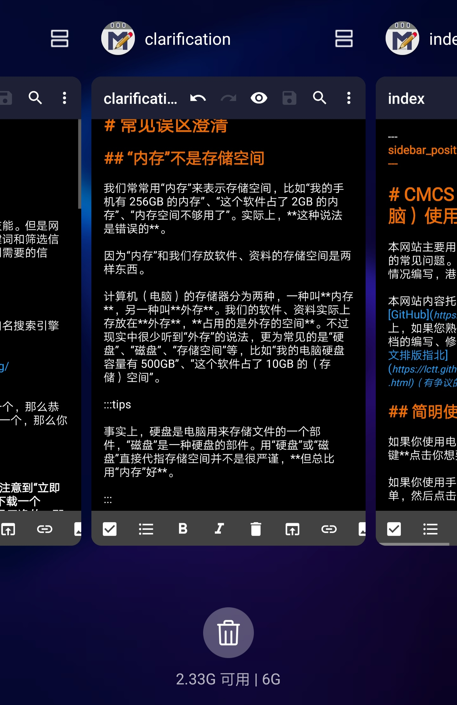
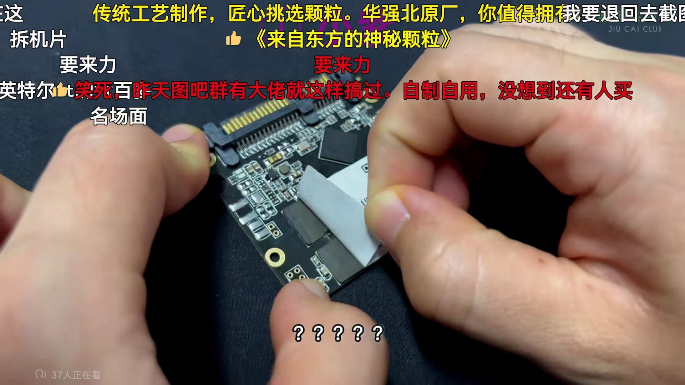

# 常见误区澄清

本页面用于澄清有关计算机（电脑）的常见误区，内容持续更新。

## “内存”不是存储空间

我们常常用“内存”来表示存储空间，比如“我的手机有 256GB 的内存”、“这个软件占了 2GB 的内存”、“内存空间不够用了”。实际上，**这种说法是错误的**。

因为“内存”和我们存放软件、资料的存储空间是两样东西。

计算机（电脑）的存储器分为两种，一种叫 **内存**，另一种叫 **外存**。我们的软件、资料实际上存放在 **外存**，**占用的是外存的空间**。不过现实中很少听到“外存”的说法，更为常见的是“硬盘”、“磁盘”、“存储空间”等，比如“我的电脑硬盘容量有 500GB”、“这个软件占了 10GB 的（存储）空间”。

:::tip

事实上，硬盘是电脑用来存储文件的一个部件，“磁盘”是一种硬盘的部件。用“硬盘”或“磁盘”直接代指存储空间并不是很严谨，**但总比用“内存”好**。

:::

而内存呢？内存实际上指的是“**运行内存**”。因为外存的特点是能持久保存数据，而且容量大，但是缺点很明显，就是 **存取速度慢**。随着电脑速度的提升，外存的速度瓶颈越来越突出，所以就发明了内存。内存的 **速度很快**，但是 **一旦断电，里面的数据就会全部丢失**。

我们打开文件和软件时，这个文件和软件就会被复制一份到内存，处理器直接和内存里的文件和软件交互，需要持久保存的数据再写回硬盘。

:::tip

“复制一份到内存”的说法并不严谨，应该是“读取到内存”，这里是为了方便大家理解。

:::

**简单来说，外存（硬盘）就好比答题卡，需要你写得工工整整，自然就写得慢；内存就好比草稿纸，写了就扔。**

另外，内存和外存不是电脑才有的，**手机也有**，只不过日常可能只能感受到外存的存在。**打开手机的“最近任务”界面，你就可以看到你手机的运行内存容量以及占用情况**（能不能看到因手机而异）。（图片下方的“2.33G 可用 | 6G”就是）

## 电脑性能（流畅度）和存储空间大小关系不大

有些人总认为电子产品“内存”（其实是存储空间）越大越流畅，事实上这是一种误区。

所谓“流畅度”其实就是性能。电脑的性能是多方面的，主要包括：

* 与加载速度有关的，例如开机速度、软件打开速度等。
* 与数据处理有关的，例如文件加密与解密。
* 与图像渲染有关的，例如不同游戏画质下的 FPS（流畅度）。
* 等等。

这些方面的性能，有的由单一的某个部件决定，有的由多个不同的部件决定。电脑的部件主要包括 CPU、显卡、内存条、主板、硬盘等。它们的优劣，共同决定了电脑的功能、性能、扩展性、续航（针对笔记本电脑）、使用舒适度等。

电脑的部件一般包含多个属性，比如 CPU 有架构、频率、核心数量等；显卡有架构、流处理器数量、频率、显存容量等；内存条有带宽、频率（与带宽有关）、容量等；硬盘有顺序读写速度、随机读写速度、容量等。

这些属性，有的决定电脑某个或多个方面的性能，有的与性能关系不大。比如内存条，它的带宽决定电脑运行速度，它的容量决定电脑能同时运行的软件个数；而对于硬盘，它的顺序读写速度决定存取大文件的速度，它的随机读写速度决定软件的加载速度，而它的容量只决定电脑能存多少资料，**和性能关系不大**。

:::tip

如果你使用采用动态 SLC Cache 方案的固态硬盘，硬盘剩余空间过小会降低读写速度，进而影响电脑性能，不过主要影响游戏或某些非常规用途（例如数据库），基本不影响日常办公。除非你使用的是劣质的固态硬盘。

:::

:::tip

事实上，不同软件占用的运行内存不同，因而内存条容量和电脑能同时运行的软件个数 **并非完全正相关**，需要依使用情景决定。

:::

:::tip

在当今，内存条带宽对电脑性能的影响，主要在于游戏方面，尤其是大型游戏，而日常办公基本感觉不到。

:::
