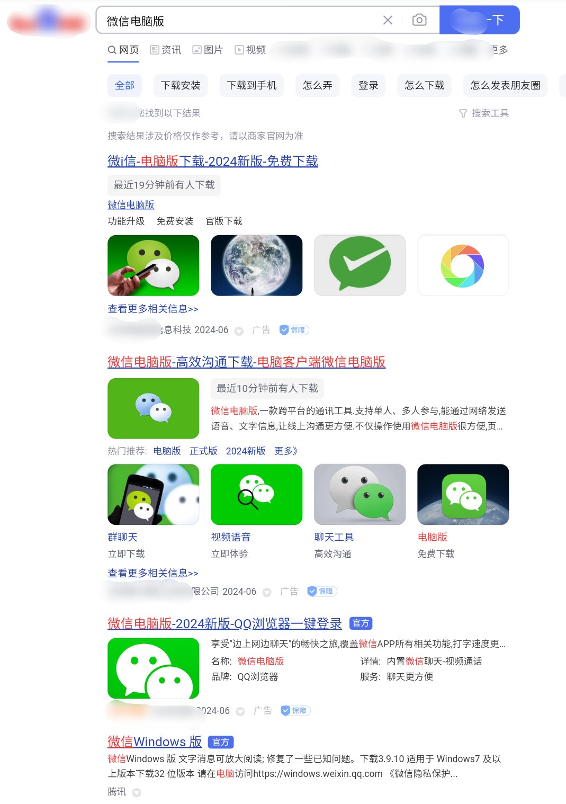
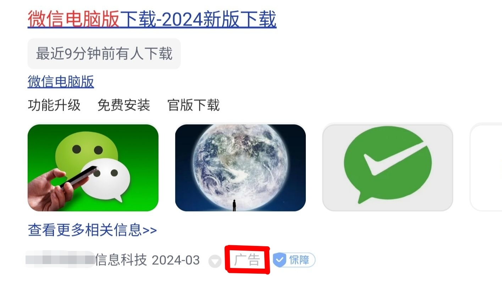
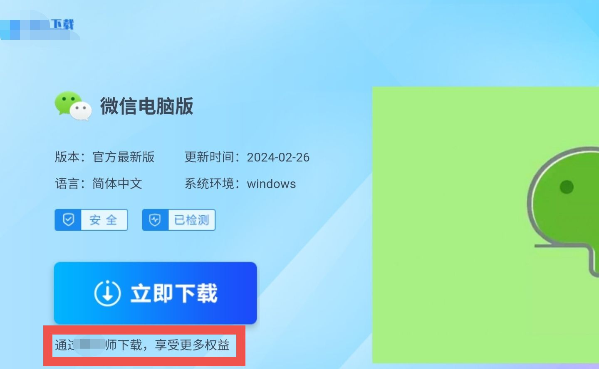
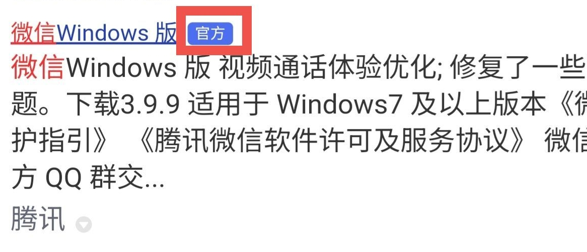

# 搜索引擎辨别广告

> 现在的中文互联网早已不似当年，在假冒伪劣广告满天飞的情况下，我们能做的就是保护好自己。

通过广告盈利情有可原，但是很多广告不但 **伪装成真正的搜索结果** 以诱导用户点击，而且 **内容往往虚假**。此外，搜索引擎往往把广告 **放在真正的搜索结果上方**，新手更容易误点。

目前，国内外搜索引擎基本上都有投放广告，我们能做的主要有两个方面：

* 学会辨别广告
* 切换到广告更少的搜索引擎

## 辨别广告

以在某知名搜索引擎搜索“微信电脑版”为例：

先看第一个结果。看起来有模有样，但是很显然，它右下角有“**广告**”的字样，**这就是广告**。

那么，既然它说了“微信电脑版下载”，它真的能提供微信电脑版的下载吗？我们点进去看一下：

**注意红框框住的文字**，它说的“通过‘\*\*师’下载”，其实就是给你下载他们推销的“\*\*师”的安装包。而这个所谓的“\*\*师”，是否被修改过，有无流氓行为，我们就不得而知了。

下面几个都带有“广告”的字样，这些都是广告。包括倒数第二个，既带有“官方”标识，右下角却带有“广告”标识的，这种也是广告，不过又恰好是另一个软件的官网而已。

而倒数第一个结果，既带有“官方”字样，又 **不像前几个广告那样花里胡哨** 的，才是真正的搜索结果。

:::tip

为了避免道德和法律问题，搜索引擎会在广告旁边标明。

此外，有的小众软件的官网，可能不会被标注“官方”的字样。

:::

:::warning

不同的搜索引擎，“广告”标识的位置可能不同，也不排除搜索引擎会变换标识的位置。

:::

## 更换搜索引擎

虽然大多数搜索引擎都含有广告，但是数量不一样，搜索结果的质量也有差别。因此我们可以通过更换搜索引擎，提高搜索效率。目前公认搜索结果质量最好的是 [必应（Bing）](https://cn.bing.com)。
