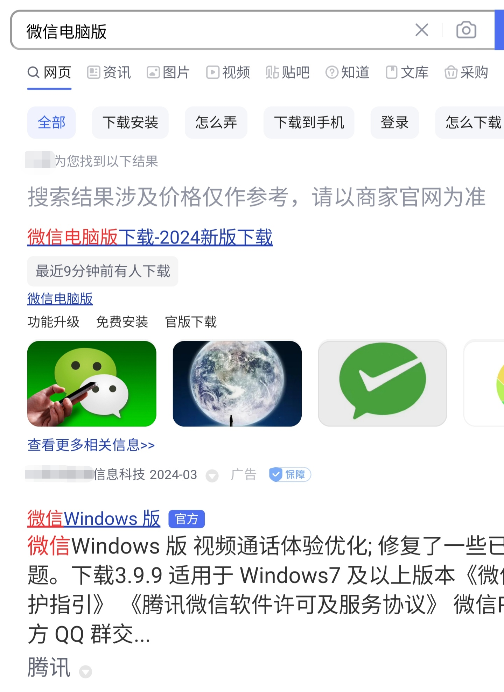
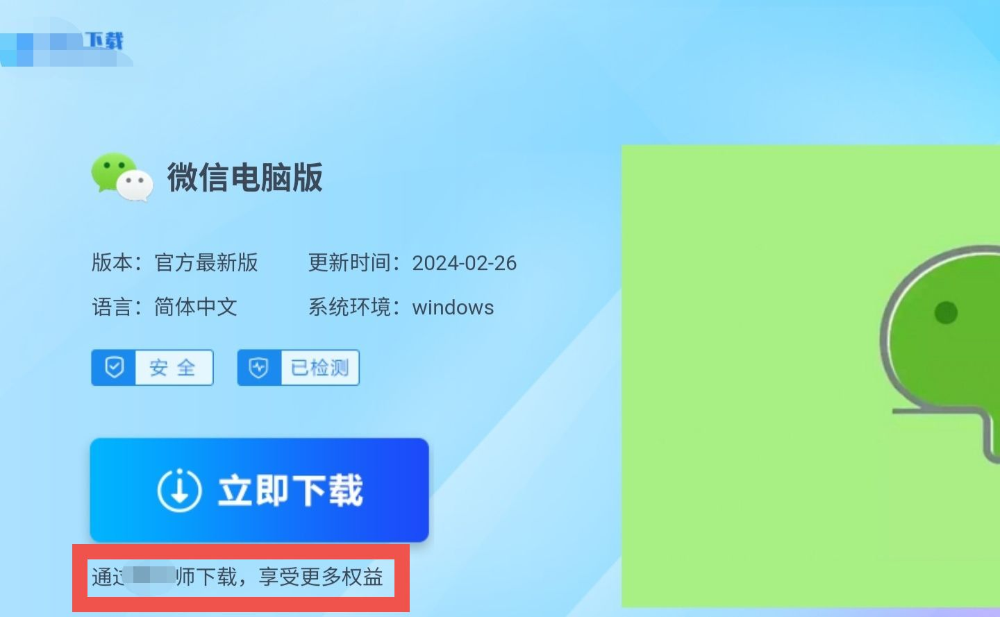
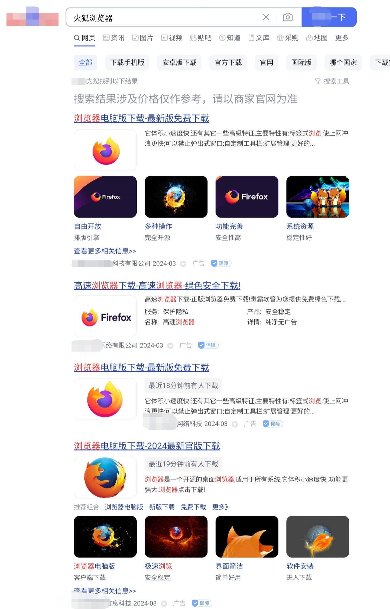
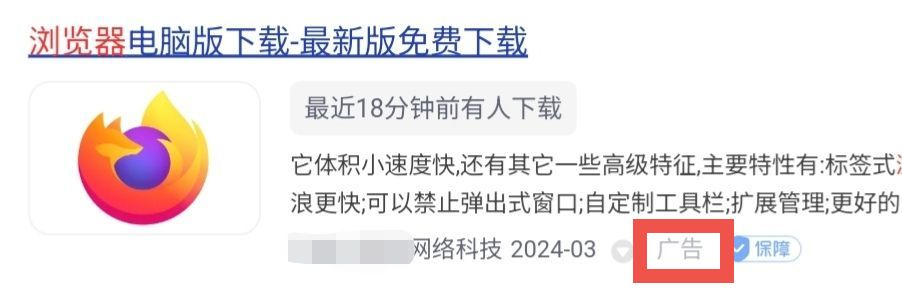
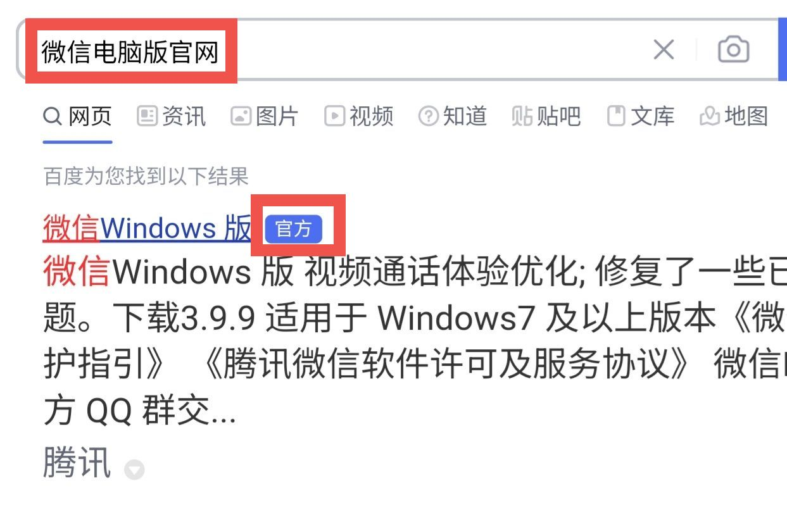
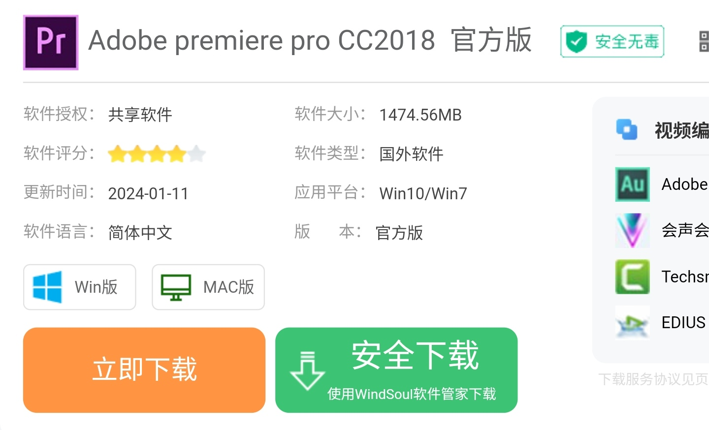

# 搜索引擎注意事项

使用搜索引擎是每个大学生的必备技能。但是网上的信息鱼龙混杂，正确的搜索关键词和筛选信息的技能可以帮助我们更好的查找到需要的信息。

## 辨别广告

搜索结果中可能包含广告，以在某知名搜索引擎搜索“微信电脑版”为例：

如果是你，你会选哪个？如果是第一个，那么恭喜你，**你上当了**！如果你选了第一个，那么你就会进入一个这样的网页：

**注意红框框住的文字**，如果你没注意到“立即下载”下边的小字，那么你最终将会下载一个叫“\*\*师”的软件。如果下载的软件是干净的，那还好说。**但如果下载的软件带有流氓软件，后果可想而知。**

这个还算是运气好，有的搜出来整页都是广告。

但是为了避免法律问题，搜索引擎需要在广告旁边注明那是广告。因此我们可以根据相应结果旁边的标注判断，如图 **红框框住的部分**。

当然，最好的方式就是更换搜索引擎。虽然主流搜索引擎都含有广告，但是数量不一样。目前公认搜索结果质量最好的是 [必应（Bing）](https://cn.bing.com)，有条件的还可以用 Google（谷歌）~~（你都能用 Google 了，还需要看这些吗）~~。

## 搜索与下载软件

用搜索引擎下载软件是一门技术，因为 **稍不留神，你的电脑就会被流氓软件占领**。

### 尽量在官网下载

一般的软件都有自己的官方网站，国内大部分搜索引擎也会注明哪些是官网。**我们可以通过搜索“软件名+官网”快速找到你要下载的软件官网。**

以微信电脑版为例。

**注意红框框住的“官方”标志**，和上文直接搜索“微信电脑版”相比，第一个变成了真正的官网。~~虽然下面依旧是一堆广告~~

此时只需要点进去，按照指引下载即可，具体可参见 [如何下载和安装软件](/404/)。

:::warning

有的软件，在国内由国内公司代理，可能存在中国版（俗称“中国特供版”）和国际版两个版本，在搜索引擎中搜到的一般是中国版，而被搜索引擎标记为“官方”的也是中国版的官网。虽然中国版官网名义上也属于官方网站，**但是部分软件的中国版存在弹窗广告、流氓软件等恶意行为**，需要注意辨别。参见 [如何下载和安装软件#当心“中国特供版”](/404/)

:::

:::tip

并不是每个搜索引擎都会标记官方网站，比如 [必应](https://cn.bing.com)。

:::

### 没有官网？那就官方渠道

有的软件并没有自己的官网，但是软件作者会用其他的方式提供下载。

各软件下载方式不一，取决于作者怎么想。有的是通过网盘分享；有的需要你加入 QQ 群，在群文件里找；有的会把软件托管在别的网站。当然，还有其他的方式。

对于把软件托管在别的网站的这种情况，比较常见的是托管在 [GitHub](https://github.com)、[SourceForge](https://sourceforge.net/) 等网站。不过我列举的这两个都是外国网站，访问速度问题需要你自己解决了。

### 当心“安全下载”和“高速下载”

有时候，我们需要下载的软件没有官方渠道，或者是因为其他原因无法从官方渠道下载（比如破解版软件），我们可能要在一些类似“软件园”、“下载站”的网站下载。这种网站一般都会给两个选项，如图。

**注意“安全下载”按钮下边的小字**，如果你没注意到，点了进去，结果同样是下载到别的软件去。
