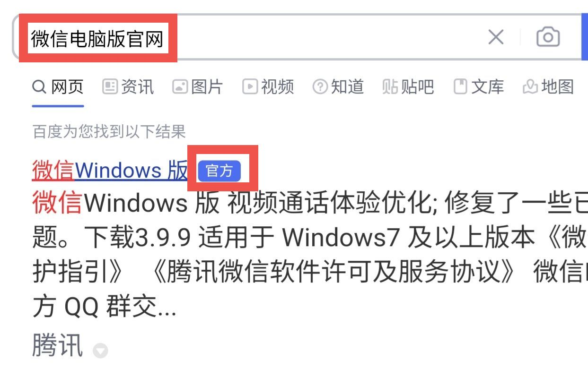
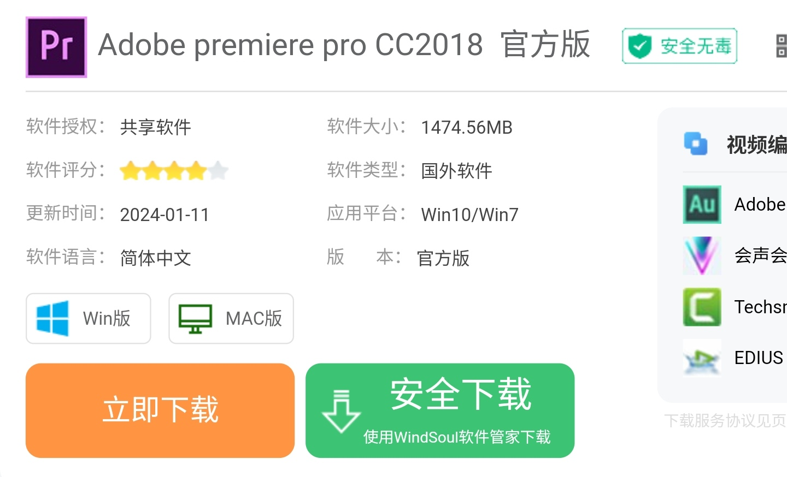

# 如何安装软件

:::danger

**安装软件时，不要无脑“下一步”！**

**安装软件时，不要无脑“下一步”！**

**安装软件时，不要无脑“下一步”！**

:::

对于手机，厂商往往已经内置了应用市场，常用软件可以在应用市场里安装。但是电脑不同，虽然电脑也自带了应用商店（即 Microsoft Store），但国人常用的软件大多没有上架，需要我们自行查找、下载安装包。

:::tip

手机软件也存在因为没有上架应用市场，或者有特殊要求，只能自行下载安装包进行安装的情况。

:::

:::warning

手机游戏，尤其是网络游戏，最好到官网下载安装包自行安装，不要在自带应用市场下载。两者是有区别的，自带应用市场下载的一般只能玩渠道服。

:::

## 使用第三方电脑应用市场（不推荐）

很多厂商都开发了适合国人使用的应用市场，上面收录了很多常用软件，还可能具备更新提醒、捆绑拦截等功能。

安装流程相对简单，和手机应用市场类似。一般是先找到搜索框，搜索自己想要的软件，然后点击下载安装即可。

:::warning

我们 **不推荐** 这种方法。因为很多第三方电脑应用市场 **本身就带有流氓行为**。

:::

## 自行搜索与下载软件

用搜索引擎下载软件是必备技能。但是在漫天广告的中文互联网，建议你先阅读 [搜索引擎辨别广告](/docs/basics/search-engine-ad)。

### 尽量在官网下载

一般的软件都有自己的官方网站，国内大部分搜索引擎也会注明哪些是官网。**我们可以通过搜索“软件名+官网”快速找到你要下载的软件官网。**

以微信电脑版为例。

和 [搜索引擎辨别广告](/docs/basics/search-engine-ad) 中直接搜索软件名称相比，后面带上“官网”二字，搜索结果的排序显然不同。第一个就是真正的官网，虽然下面依旧是大量广告。

:::warning

道高一尺魔高一丈，不排除以后这种搜索方法会失效。

:::

此时只需要点进去，按照指引下载即可。

如果网站提供了多个下载选项，一般选择带有一个或多个下列的关键词的选项。

* Windows
* 64 位
* x64
* amd64
* 电脑版

:::warning

有的软件，在国内由国内公司代理，可能存在中国版和国际版两个版本，在搜索引擎中搜到的一般是中国版，而被搜索引擎标记为“官方”的往往也是中国版的官网。虽然中国版官网名义上也属于官方网站，**但是部分软件的中国版存在弹窗广告、流氓软件等恶意行为**（存在这种行为的，一般被蔑称为“中国特供版”），需要注意辨别。

:::

:::tip

并不是每个搜索引擎都会标记官方网站，比如 [必应](https://cn.bing.com)。

:::

### 没有官网？那就官方渠道

有的软件并没有自己的官网，但是软件作者会用其他的方式提供下载。

各软件下载方式不一，取决于作者怎么想。有的是通过网盘分享；有的需要你加入 QQ 群，在群文件里找；有的会把软件托管在别的网站。当然，还有其他的方式。

对于把软件托管在别的网站的这种情况，比较常见的是托管在 [GitHub](https://github.com)、[SourceForge](https://sourceforge.net/) 等网站。不过我列举的这两个都是外国网站，访问速度问题需要你自己解决了。

### 当心“安全下载”和“高速下载”

有时候，我们需要下载的软件没有官方渠道，或者是因为其他原因无法从官方渠道下载（比如破解版软件），我们可能要在一些类似“软件园”、“下载站”的网站下载。这种网站一般都会给两个选项，如图。

**注意“安全下载”按钮下边的小字**，如果你没注意就直接点，最后下载的就是他们推销的别的软件的安装包。

## 安装软件

:::danger

安装软件时，不要无脑“下一步”！

每一步都看清楚！很多国产软件（包括一些大厂出品的）会故意设置陷阱！

:::

> 剩下的等我更新。
> 
> ーー站长：vvvbbbcz
